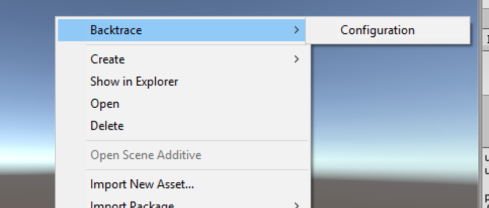
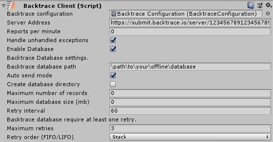
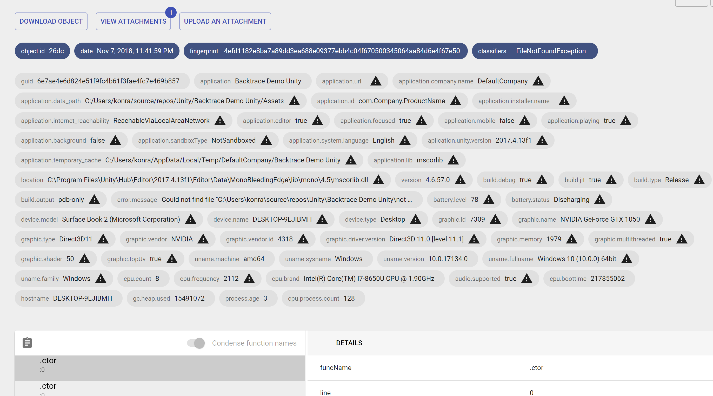

# Backtrace Unity support

[Backtrace](http://backtrace.io/)'s integration with unity games allows customers to capture and report handled and unhandled untiy exceptions to their Backtrace instance, instantly offering the ability to prioritize and debug software errors.

[Github Release]:(https://github.com/backtrace-labs/backtrace-labs/)

## Usage

```csharp

 //Read from manager BacktraceClient instance
var backtraceClient = GameObject.Find("manager name").GetComponent<BacktraceClient>();
try{
    //throw exception here
}
catch(Exception exception){
    var report = new BacktraceReport(exception);
    backtraceClient.Send(report);
}
```

# Features Summary <a name="features-summary"></a>
* Light-weight Unity client  that quickly submits crashed generated in Unity environment to your Backtrace dashboard
  * Can include callstack, system metadata, custom metadata, custom attribues and file attachments if needed,
* Supports a wide range of unity version and environments,
* Supports .NET 4.5 Backend, IL2CPP and Mono environments,
* Supports offline database for error report storage and re-submission in case of network outage,
* Fully customizable and extendable event handlers,
* Custom IDE integrations.

# Prerequisites
* Unity environment 2017.4.x 
* .NET 4.5 scripting runtime version, 
* Mono or IL2CPP scripting backend.

# Setup <a name="installation"></a>
List of steps necessary to setup full Backtrace Unity integration.

## Installation guide
* Download and unzip zip file with backtrace-unity support library,
* Open your Unity project and paste unzipped library directory,
* Your library is ready to use!

## Library configuration
* Select scene object and add new component in inspector window,
* Select `Backtrace Client` from insperctor search box,
* `Backtrace Client` configuration window now waiting for configuration asset.

* Right click on empty space in Unity workspace and select from the menu box `Backtrace > Configuration`. This option generate new empty asset file in your solution. You can drag and drop generated asset file into Backtrace Client configuration window.

* Provide valid Backtrace client configuration and start using library!


**Field overview**
* *Server url*: the url to Backtrace server instance. The user can start
typing only their instance name (for example "my-bt-server"), and the plugin will guess
the rest of the server url (for example "https://my-bt-server.sp.backtrace.io"). 


* *Token*: Token to the Backtrace project instance. This field requires
that the provided string has exactly **64** characters. If the developer doesn't
know or doesn't have the access token, the plugin allows the user to browse
tokens if the project name is available.

* *ReportsPerMinute*: Determine how many reports `Backtrace Unity` library should send per minute.

* *Handle unhandle exceptions*: Determine if library by default should handle unhandled exceptions. 


## Database support configuration
Backtrace Unity integration allows to store on hard drive offline reports. `BacktraceDatabase` provide methods to save reports when you lost a connection. 

To setup `BacktraceDatabase` configuraiton:
* Select `Enable Database` checkbox in `Backtrace Client` configuration window,
* Provide valid Backtrace database configuration and store offline reports in your game!



**Field overview**
* `BacktraceDatabase` can use diffrent *Server url* *Token* *Reports per minute* and *Handle unhandled exceptions* values. These values are necessary if user want to send an offline reports to any `Backtrace` server,
* *Backtrace Database path*: Path to directory where Backtrace database will store reports. Be aware! `Backtrace database` will remove all existing files on database start,
* *Automatically send*: Determine if database should send automatically reports to `Backtrace` server,
* *Create database directory*: Determine if library should create offline database directory if provided path doesn't exists,
* *Maximum number of records*: Maximum number of stored reports in database. If value is equal to zero, then limit not exists,
* *Maximum database size*: Maximum database size in MB. If value is equal to zero, then size is unlimited,
* *Retry interval*: How much seconds library should wait before next retry,
* *Maximum retries*: Maximum number of retries,
* *RetryOrder*: Record order in database.


## Web debugger result:


# Api overview

## Basic configuration
If you setup `Backtrace client` and `Backtrace database` configuration you can retrieve database and client instances by using `GameObject`. When you retrieve client instance you can start sending reports from try/catch blok in your game!

```csharp

 //Read from manager BacktraceClient instance
var backtraceClient = GameObject.Find("manager name").GetComponent<BacktraceClient>();

 //Read from manager BacktraceClient instance
var database = GameObject.Find("manager name").GetComponent<BacktraceDatabase>();


try{
    //throw exception here
}
catch(Exception exception){
    var report = new BacktraceReport(exception);
    backtraceClient.Send(report);
}
```

## Sending an error report <a name="documentation-sending-report"></a>

`BacktraceClient.Send` method will send an error report to the Backtrace endpoint specified. There `Send` method is overloaded, see examples below:

### Using BacktraceReport

The `BacktraceReport` class represents a single error report. (Optional) You can also submit custom attributes using the `attributes` parameter, or attach files by supplying an array of file paths in the `attachmentPaths` parameter.

```csharp
try
{
  //throw exception here
}
catch (Exception exception)
{
    var report = new BacktraceReport(
        exception: exception,
        attributes: new Dictionary<string, object>() { { "key", "value" } },
        attachmentPaths: new List<string>() { @"file_path_1", @"file_path_2" }
    );
    backtraceClient.Send(backtraceReport);
}
```
Notes:
- if you setup `BacktraceClient` with `BacktraceDatabase` and your application is offline or you pass invalid credentials to `Backtrace server`, reports will be stored in database directory path,
- `BacktraceReport` allows you to change default fingerprint generation algorithm. You can use `Fingerprint` property if you want to change fingerprint value. Keep in mind - fingerprint should be valid sha256 string.,
- `BacktraceReport` allows you to change grouping strategy in Backtrace server. If you want to change how algorithm group your reports in Backtrace server please override `Factor` property.

If you want to use `Fingerprint` and `Factor` property you have to override default property values. See example below to check how to use these properties:

```csharp
try
{
  //throw exception here
}
catch (Exception exception)
{
    var report = new BacktraceReport(...){
        FingerPrint = "sha256 string",
        Factor = exception.GetType().Name
    };
    ....
}

```

## Attaching custom event handlers <a name="documentation-events"></a>

`BacktraceClient` allows you to attach your custom event handlers. For example, you can trigger actions before the `Send` method:
 
```csharp

 //Add your own handler to client API

backtraceClient.BeforeSend =
    (Model.BacktraceData model) =>
    {
        var data = model;
        //do something with data for example:        
        data.Attributes.Add("eventAtrtibute", "EventAttributeValue");
        if(data.Classifier == null || !data.Classifier.Any())
        {
            data.Attachments.Add("path to attachment");
        }

        return data;
    };
```        
   
`BacktraceClient` currently supports the following events:
- `BeforeSend`
- `OnClientReportLimitReached`
- `OnServerResponse`
- `OnServerError`

## Reporting unhandled application exceptions
`BacktraceClient` supports reporting of unhandled application exceptions not captured by your try-catch blocks. To enable reporting of unhandled exceptions even if you dont set this option in `Backtrace configuration window` please use code below:
```csharp
backtraceClient.HandleApplicationException();
``` 

## Flush database
When your application starts, database can send stored offline reports. If you want to do make it manually you can use `Flush` method that allows you to send report to server and then remove it from hard drive. If `Send` method fails, database will no longer store data. 

```csharp
backtraceDatabase.Flush();
```

## Clearing database
You can clear all data from database without sending it to server by using `Clear` method. `BacktraceDatabase` will remove all files and won't send it to server. 

```csharp
backtraceDatabase.Clear();
```


# Architecture description

## BacktraceReport  <a name="architecture-BacktraceReport"></a>
**`BacktraceReport`** is a class that describe a single error report.

## BacktraceClient  <a name="architecture-BacktraceClient"></a>
**`BacktraceClient`** is a class that allows you to send `BacktraceReport` to `Backtrace` server by using `BacktraceApi`. This class sets up connection to the Backtrace endpoint and manages error reporting behavior (for example, saving minidump files on your local hard drive and limiting the number of error reports per minute). `BacktraceClient` inherits from `Mono behaviour`.

`BacktraceClient` requires from a `Backtrace configuration window`
- `Sever url` - url to `Backtrace` server,
- `Token` - token to `Backtrace` project,
- `ReportPerMin` - A cap on the number of reports that can be sent per minute. If `ReportPerMin` is equal to zero then there is no cap.
- `HandlUnhandleException` - flag that allows `BacktraceClient` handling unhandled exception by default.

## BacktraceData  <a name="architecture-BacktraceData"></a>
**`BacktraceData`** is a serializable class that holds the data to create a diagnostic JSON to be sent to the Backtrace endpoint via `BacktraceApi`. You can add additional pre-processors for `BacktraceData` by attaching an event handler to the `BacktraceClient.BeforeSend` event. `BacktraceData` require `BacktraceReport` and `BacktraceClient` client attributes.

## BacktraceApi  <a name="architecture-BacktraceApi"></a>
**`BacktraceApi`** is a class that sends diagnostic JSON to the Backtrace endpoint. `BacktraceApi` is instantiated when the `BacktraceClient` awake method is called. `BacktraceApi` can asynchronous reports to the Backtrace endpoint. 

## BacktraceDatabase  <a name="architecture-BacktraceDatabase"></a>
**`BacktraceDatabase`** is a class that stores error report data in your local hard drive. `BacktraceDatabase` stores error reports that were not sent successfully due to network outage or server unavailability. `BacktraceDatabase` periodically tries to resend reports 
cached in the database.  In `BacktraceDatabaseSettings` you can set the maximum number of entries (`Maximum retries`) to be stored in the database. The database will retry sending 
stored reports every `Retry interval` seconds up to `Retry limit` times, both customizable in the `Backtrace database configuration`. 

`Backtrace database` has the following properties:
- `Database path` - the local directory path where `BacktraceDatabase` stores error report data when reports fail to send,
- `MaxRecordCount` - Maximum number of stored reports in Database. If value is equal to `0`, then there is no limit.
- `MaxDatabaseSize` - Maximum database size in MB. If value is equal to `0`, there is no limit.
- `AutoSendMode` - if the value is `true`, `BacktraceDatabase` will automatically try to resend stored reports. Default is `false`.
- `RetryBehavior` - 
	- `RetryBehavior.ByInterval` - Default. `BacktraceDatabase` will try to resend the reports every time interval specified by `RetryInterval`.
	- `RetryBehavior.NoRetry` - Will not attempt to resend reports
- `RetryInterval` - the time interval between retries, in seconds.
- `RetryLimit` - the maximum number of times `BacktraceDatabase` will attempt to resend error report before removing it from the database.

If you want to clear your database or remove all reports after send method you can use `Clear` and `Flush`.

## ReportWatcher  <a name="architecture-ReportWatcher"></a>
**`ReportWatcher`** is a class that validate send requests to the Backtrace endpoint. If `reportPerMin` is set in the `BacktraceClient` constructor call, `ReportWatcher` will drop error reports that go over the limit. `BacktraceClient` check rate limit before `BacktraceApi` generate diagnostic json. 


# Nice to know
* Backtrace Unity integration use JSON.NET library to create diagnostic JSON. JSON.NET Source code is available in `src` directory.


